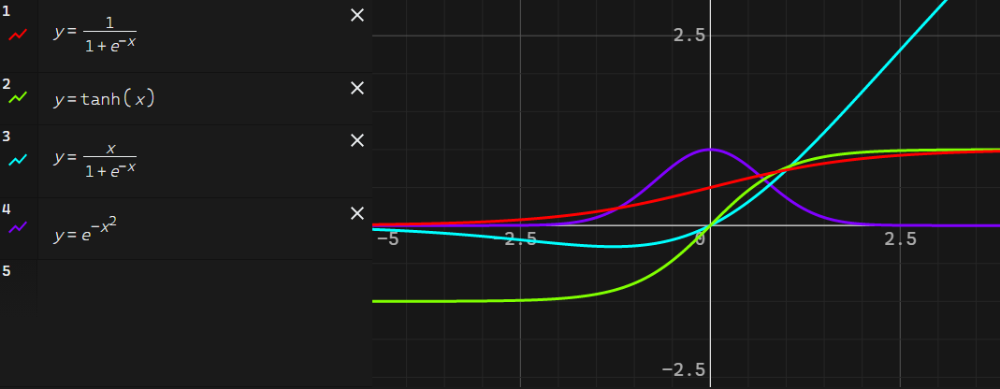

# Graphing Calculator

  

## Installation
``yarn install``  
Install node modules

## Running
``yarn start``  
Run in development mode

``yarn build``  
Build for production

## Features
- ### Expression parsing:
  - Support for latex using [mathquill](http://mathquill.com/)
  - Parse which variables the expression defines and depend on
  - Check if expression is valid
    - Gives each valid expression a distinct color
    - Weight each expression and sort the order in which they need to be evaluated to solve and dependency
- ### Expression evaluation:
  - Send expressions to a web worker
  - Expressions are evaluated using [mathjs](https://mathjs.org/)
  - Results are cached
- ### Displaying Results:
  - Results are converted to screen space and rendered using canvas
  - Move around by holding left click and dragging mouse
  - Zoom using scroll wheel

## Plans
- Dynamic resolution based on graph complexity
- Find discontinuities
  - Previous version had this but it ran too slow to use in real time
- Floating precision
  - Change datatypes to something with more precision
- Saving/loading/sharing graphs
